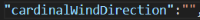
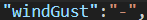

# computer_infrastructure_assessment
Repository for Semester 2 Computer Infrastructure assessment

## Installation & Usage Instructions

### Clone the repository from GitHub

1. Copy the following URL:
https://github.com/Ange-Dvs/computer_infrastructure_assessment.git

1. Open CMDER or if using VS Code open the terminal pane

1. Navigate to the folder where you want to clone the repository to on your machine and type git pull
``git clone`` https://github.com/Ange-Dvs/computer_infrastructure_assessment.git

1. Set merge as the mode for the pull
``git config pull.rebase false``

1. Initiate the pull of the GitHub repository
``git pull``

If the pull has been successful, you should see   
- ``.github`` directory 
- ``weather-data.yml``
- ``data`` directory 
- ``timestamps`` sub-directory 
- ``weather`` sub-directory
- ``images`` directory
- ``myfunctions.py`` file
- ``README.md`` file
- ``.gitignore`` file
- ``requirements.txt`` file
- ``weather.ipynb`` notebook
- ``weather.sh`` script

### Install dependencies

Ensure you have Python installed and the required libraries. 
Dependencies can be installed using the ``requirements.txt`` file by running the below command either in the command line or in the terminal in VS Code.
``pip install -r requirements.txt``

The libraries can also be installed individually as specified in the ``weather.ipynb`` notebook.

### Run the Notebook

1. Launch Jupyter Notebook on your system and navigate to ``weather.ipynb`` file in the directory and open it.
1. Execute the cells sequentially, by clicking **Run all**. This will load the weather dataset, render the markdown cells and generate the plots.

If any errors occur, check your dependencies and ensure all libraries are installed correctly.

## GitHub Codespaces

For the automation of the ``weather.sh`` script GitHub Codespaces was used.  

## Dependencies

## Dataset

The data used for the weather.ipynb notebook originates from a platform owned by Met Éireann.  
Met Éireann runs various weather stations across the country, the data used in this project comes from their Athenry location.  
The data is downloaded using their API to download the data in ``.json`` format.  
The file is then read into the notebook to be analysed using the ``pandas`` function ``read_json()``.  

### Cleaning the data 

During testing of the notebook it was seen that occasionally there would be missing data in the ``.json`` file, which is not uncommon when using real data.  
The way in which the missing entries were shown was inconsistent with blank values sometimes being represented as empty quotation marks or by using a hyphen.  

From a review of the ``.json`` file it appeared that the empty quotation marks were how the blank entries in a text field was represented while the hyphen appeared to be used for the cases where the a numeric value would be expected. The blank string fields would cause issues when generating the various plots. The "-" string being in place instead of a numeric value in some fields would cause issues when attempting to do calculations where a numeric value would be expect.  

Examples of occurrences of malformed or missing data:  
   
    

To avoid this at the beginning of the notebook the data is checked and corrected to avoid issues in calculations when the cells are executed.  
The fields which are used for calculations are specified in a variable called ``numeric_field_to_convert``.  
This variable is then used to cycle through these values in the DataFrame for each field and convert the field to a numeric data type.  
If a string is in place of a numeric value, for example the hyphen shown in the screenshot above an error is thrown.  
With this, ``errors='coerce'`` is used to take any values causing an error and change the value of the field for that entry to NaN to avoid issues.

After this the entire dataset is check for the occurrence of empty quotation marks in a field. This is then also replaced with NaN using ``numpy.nan`` with ``inplace`` set to ``True``.  

## Historical data 
ATHENRY
date:Date and Time (utc)
rain:Precipitation Amount (mm)
temp:Air Temperature (C)
rhum:Relative Humidity (%)
wdsp:Mean Wind Speed (kt)
wddir:Predominant Wind Direction (deg)
msl:Mean Sea Level Pressure (hPa) (pressure) 

## Additional resources & reading

### Libraries used

Within the project various external libraries are used including: 

- ``Pandas``
- ``Matplotlib.pyplot``
- ``Seaborn``
- ``Matplotlib.dates``
- ``NumPy``

###

chrome-extension://efaidnbmnnnibpcajpcglclefindmkaj/https://cli.fusio.net/cli/stormcenter/PDF/Elin.pdf > storm elin 2023
https://www.met.ie/climate/climate-of-ireland#:~:text=It's%20a%20zone%20of%20transition,typical%20of%20the%20Irish%20climate.

enumerate()
idxmin()
.strftime('%H:%M')
.abs()
https://seaborn.pydata.org/generated/seaborn.heatmap.html
https://seaborn.pydata.org/generated/seaborn.pairplot.html
https://seaborn.pydata.org/tutorial/distributions.html#kernel-density-estimation
https://seaborn.pydata.org/generated/seaborn.histplot.html
https://seaborn.pydata.org/generated/seaborn.kdeplot.html
https://www.analyticsvidhya.com/blog/2023/12/mastering-tabulate/
https://stackoverflow.com/questions/70630387/saving-functions-into-package-in-jupyter-notebooks
https://www.w3schools.com/python/pandas/ref_df_describe.asp
https://pandas.pydata.org/docs/reference/api/pandas.DataFrame.describe.html
https://pandas.pydata.org/pandas-docs/stable/reference/api/pandas.DataFrame.filter.html
https://pandas.pydata.org/pandas-docs/stable/reference/api/pandas.DataFrame.loc.html#pandas.DataFrame.loc
https://www.codecademy.com/resources/docs/pandas/dataframe/loc

### External resources links
https://pandas.pydata.org/docs/reference/api/pandas.read_json.html#pandas-read-json
https://www.w3schools.com/python/pandas/pandas_json.asp
https://www.geeksforgeeks.org/visualizing-json-data-in-python/
https://scales.arabpsychology.com/stats/how-do-i-combine-two-date-and-time-columns-into-one-in-a-pandas-dataframe/
https://sparkbyexamples.com/pandas/pandas-drop-last-column-from-dataframe/#:~:text=To%20drop%20the%20last%20column,pop()%20%2C%20and%20del%20functions.
https://stackoverflow.com/questions/45196965/pandas-drop-last-column-of-dataframe
https://matplotlib.org/stable/users/explain/colors/colormaps.html#qualitative
https://matplotlib.org/stable/api/dates_api.html#matplotlib-dates
https://matplotlib.org/stable/api/dates_api.html#date-formatters